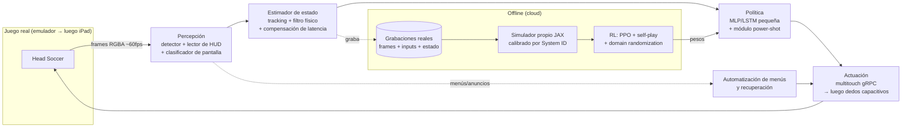

# Head Soccer AI — Plan maestro

> **Estado:** v0.2 · plan aprobado, Fase 0 en curso · 2026-09-28 · decisiones registradas en [docs/adr/](adr/)
> **Meta:** un agente que juega Head Soccer (D&D Dream) **viendo solo la pantalla** y **tocando la pantalla**, y que le gana a la CPU de forma consistente. Primero en un emulador Android en el Mac y luego en un iPhone/iPad físico.

---

## 0. Resumen ejecutivo

| Tema | Decisión propuesta | Por qué, en una línea |
|---|---|---|
| Arquitectura | Pipeline modular: **visión → estimador de estado → política → actuación** | Cada pieza se puede medir y depurar por separado, y el RL no depende de los píxeles |
| Entrenamiento | **RL en un simulador propio calibrado con datos reales** + arranque por imitación y un bot scripted | El juego real solo corre en tiempo real; el RL necesita del orden de 10⁸ pasos o más |
| Personajes | **Una sola política condicionada por personaje** (el propio y el rival) + especialistas solo si los datos lo justifican | ~90% de la habilidad se comparte y los personajes difieren sobre todo en 5 stats y en su power shot |
| Plataforma v1 | **Emulador oficial de Android (ARM64 + Play Store) en el M3** | Captura sin compresión a ~60 fps, multitouch por gRPC y snapshots para reiniciar |
| Plataforma v2 | iPad/iPhone físico: captura por USB + "dedos" capacitivos electrónicos | iOS no permite inyectar multitouch sin jailbreak y el juego no anuncia soporte de mando |
| Alcance | Solo modos offline contra la CPU | Usarlo en multijugador online es hacer trampa contra personas |

El patrón tiene precedentes: **RLGym + RocketSim** entrenó bots de Rocket League en un simulador propio que corre miles de veces más rápido que el juego y luego los desplegó en el juego real (Nexto llegó a ~Grand Champion). **SlimeVolleyGym**, un 1v1 en 2D con saltos y física de balón muy parecido a Head Soccer, es el entorno de referencia para PPO con self-play. Nuestra variante añade algo que ellos no tenían: el estado sale de **visión**, no de la memoria del juego.

---

## 1. Lo que sabemos del juego (research)

### 1.1 Hechos verificados

- **Desarrollador:** D&D Dream (Corea). Salió en iOS en 2012 y en Android en 2013. Versión actual: **7.1.5** (junio 2026), con más de 100 millones de descargas. No existe versión para Mac en la App Store. El APK de Android incluye `arm64-v8a`, así que corre nativo en el emulador ARM del M3.
- **Personajes:** más de 101. Cada uno tiene **5 stats mejorables**: Speed, Jump, Kick, Power y Dash.
- **Controles:** izquierda y derecha, salto, patada y el botón de **power** cuando la barra está llena. **Doble toque en izquierda o derecha = dash.**
- **Partido:** dura **60 s** y gana quien marque más goles. Si hay empate se juega **muerte súbita**: la barra de power deja de cargarse, pero un power ya cargado se conserva y se puede usar una vez.
- **Power shots:** son únicos por personaje y muchos tienen **tres variantes según el contexto**: **en el aire, en el suelo o de contraataque**.
  - Por trayectoria: rectos (South Korea, USA), curvos (Brazil, Russia), multibalón (Japan: 5 balones y solo el verde cuenta; Germany: 3), con retraso (Argentina, Egypt) o invisibles (USA, Turkey).
  - Por efecto: stun o empujón, **congelar** (Russia), **invertir los controles** (Brazil), transformar al rival en otra forma, hacerlo desaparecer, invocar entidades.
- **Counter:** si presionas *kick* justo antes de que te llegue un power shot, lo devuelves. Es la mecánica defensiva avanzada clave.
- **Comportamiento de la CPU (según la wiki):** activa su power shot **en cuanto lo tiene**, salta en momentos predecibles y toma malas decisiones defensivas. Es explotable y conviene medirlo.
- **Modos:** Arcade, Tournament, Survival, League (Amateur, Minor y Major), Head Cup, Death Mode (con obstáculos), Fight Mode (barra de vida y K.O.), Awaken Mode y Multiplayer.
- **Costumes:** hay 93, en rangos F–SS, con bonus de +0 a +7 a los stats. Los de rango C o superior tienen efectos propios en el partido (proyectiles, fuego, hielo, cambios de tamaño) y se pueden perder de una patada durante el partido. También existen Pets y Bodies.

### 1.2 Lo que NO sabemos y hay que medir (Fase 1)

- FPS interno del juego y si la física corre en un paso fijo.
- Gravedad, coeficientes de rebote (suelo, poste, travesaño, cabezas), fricción y velocidad máxima del balón.
- Velocidades de caminar y de dash, altura y duración del salto, impulso de la patada y del cabezazo, y cómo escala cada uno con los stats.
- Forma de los hitboxes (cabeza, pie, travesaño) y si se puede estar parado encima del travesaño.
- Cuánto tarda en cargarse la barra de power y qué la acelera (¿tocar el balón?).
- Si aparecen ítems o power-ups aleatorios en los partidos normales.
- Layout exacto de los botones en pantalla y cómo se comporta el multitouch.
- Diferencias de dificultad de la CPU entre modos y entre rivales.

---

## 2. Mi opinión: ¿un algoritmo por personaje?

**Recomendación: no como punto de partida.** Propongo **una sola política "generalista" condicionada por personaje** y **especialistas solo donde las métricas demuestren que hacen falta**.

Razones:

1. **La mayor parte de la habilidad se comparte:** leer la trayectoria del balón, posicionarse entre el balón y el arco, el momento del salto, cabezazos, patadas y defensa. Cien modelos separados aprenderían esto cien veces, cada uno con 1/100 de los datos.
2. **Los personajes difieren sobre todo en dos cosas, y ambas se pueden dar como entrada al modelo:**
   - 5 stats continuos → un vector numérico.
   - El power shot, con sus variantes aire, suelo y contraataque → un *embedding* del personaje más un sub-módulo que decide **cuándo y dónde** activarlo.
3. **El rival importa tanto como el personaje propio.** Defenderse de los 5 balones de Japan no se parece en nada a defenderse del congelamiento de Russia. Con modelos por personaje tendrías que cubrir 100×100 enfrentamientos. Un modelo condicionado en (personaje propio, rival) lo resuelve de forma natural.
4. **Precedentes:**
   - **OpenAI Five** usó un solo modelo con embeddings de héroe para muchos héroes que comparten mecánicas.
   - **AlphaStar** usó agentes separados por raza porque las 3 razas son casi juegos distintos.
   - Los personajes de Head Soccer se parecen mucho más a los héroes de Dota que a las razas de StarCraft.
5. **Escala mejor:** añadir un personaje consiste en medir sus stats, implementar su power shot en el simulador y hacer un fine-tune corto, no en empezar un proyecto nuevo.

**Estrategia concreta:**

- Empezamos con **1 personaje contra 1 rival** (un vertical slice) para validar todo el pipeline.
- Después entrenamos la política condicionada con **agrupaciones de power shots** (rectos, curvos, multibalón, retardados, invisibles; congelar, invertir, stun, transformar) para priorizar qué implementar en el simulador.
- Si algún personaje queda por debajo del objetivo, entrenamos un **especialista por fine-tuning** y, si hace falta, lo **destilamos** de vuelta al generalista.

---

## 3. Arquitectura



### 3.1 Por qué no hacer RL end-to-end desde píxeles sobre el juego real

- **Presupuesto de muestras:** el juego corre en tiempo real y con 8 GB de RAM podemos tener **una sola instancia**.
  - A 15 decisiones por segundo son ~1,3 millones de pasos al día en el mejor caso, sin contar menús y anuncios.
  - PPO para un juego competitivo de este tipo necesita entre 10⁸ y 10⁹ pasos, o sea **entre meses y años** de juego real.
  - En un simulador vectorizado en GPU llegamos a ~10⁶ pasos por segundo.
- **El sim-to-real en espacio de estado es mucho más fácil que en píxeles:** el simulador **no necesita parecerse visualmente** al juego, solo comportarse igual. La percepción se entrena aparte con frames reales.
- **Es depurable:** si el bot falla sabemos si fue porque "no vio el balón", "estimó mal su velocidad", "decidió mal" o "el toque llegó tarde".

### 3.2 Contrato de estado (borrador)

```
ball:        x, y, vx, vy, flags{on_fire, invisible, is_decoy, ...}
players[2]:  x, y, vx, vy, grounded, kicking, facing,
             effects{frozen, reversed, stunned, transformed, gone} + remaining_time
power[2]:    gauge ∈ [0,1], active_power_shot_type
match:       score[2], time_left, sudden_death, mode
characters:  id_self, id_rival, stats_self[5], stats_rival[5]
extras:      list[projectiles/obstacles] (padded), costume_effects
```

Las coordenadas van en **unidades del campo**, no en píxeles. Así la política no cambia al pasar del emulador al iPad.

### 3.3 Espacio de acciones

`MultiDiscrete`: mover `{izq, nada, der}` × `salto {0,1}` × `patada {0,1}` × `power {0,1}`, más **macro-acciones de dash** (`dash_izq`, `dash_der`). El actuador traduce cada macro-acción a un doble toque con el timing correcto, para que la política no tenga que aprenderse ese timing. Decidimos a **15–30 Hz** (se fija con datos en la Fase 1).

### 3.4 Presupuesto de latencia (objetivo inicial)

| Etapa | Objetivo p95 |
|---|---|
| Captura (gRPC, raw) | ≤ 17 ms |
| Percepción + estado | ≤ 10 ms en el M3 (CoreML/ONNX) |
| Política | ≤ 2 ms |
| Inyección del toque | ≤ 10 ms |
| **Total, de pantalla a pantalla** | **< 60 ms** |

Medimos la latencia **de pantalla a pantalla**: inyectamos un toque que produce un cambio visible y medimos cuánto tarda en aparecer. Esa distribución real entra luego como aleatorización en el simulador.

---

## 4. Decisiones técnicas

Cada decisión importante queda registrada como **ADR** (Architecture Decision Record) en `docs/adr/`, con el contexto, las opciones, la decisión y sus consecuencias. Las marcadas con 🔬 se deciden **con un benchmark o un spike**, no por opinión.

| # | Decisión | Elección propuesta | Alternativas | Motivo |
|---|---|---|---|---|
| [0002](adr/0002-android-emulator-first.md) ✅ | Plataforma v1 | Emulador de Android Studio, imagen **ARM64 con Google Play**, juego instalado **desde Play Store** | BlueStacks, teléfono Android físico | Scriptable, `streamScreenshot` en RGBA sin decodificar, `sendTouch` multitouch y `streamInputEvent`, snapshots reproducibles. Se instala desde la tienda oficial y no desde webs de APKs |
| [0004](adr/0004-pin-game-version.md) ✅ | Versión del juego | **Fijar la 7.1.5**, desactivar las actualizaciones automáticas y guardar un snapshot del AVD | — | Una actualización puede cambiar la física y romper la calibración |
| [0001](adr/0001-modular-sim-to-real-architecture.md) ✅ | Enfoque general | Modular con sim-to-real en espacio de estado | RL desde píxeles, world model aprendido (DreamerV3/DIAMOND) | Ver §3.1. El world model queda como **track de investigación opcional** para comparar al final |
| pendiente 🔬 | Simulador | **JAX** (`jit` + `vmap`, entrenamiento al estilo PureJaxRL) | Entorno en C + **PufferLib** | JAX es **diferenciable** (System ID con gradientes), todo corre en GPU/TPU en la nube y el código está en un solo lenguaje. Si las colisiones o el rendimiento fallan, pasamos a C + PufferLib (el entorno solo supera los 100M pasos/s; con entrenamiento, 1–4M pasos/s) |
| pendiente 🔬 | Detector | Benchmark de **RF-DETR Nano** (Apache-2.0), **una red de heatmaps propia** (estilo CenterNet-lite) y YOLO11n | — | Juego 2D con sprites fijos, así que una red pequeña propia puede ganar en latencia. Ojo: YOLO es **AGPL-3.0**, lo que importa en un portafolio público |
| pendiente | HUD | Clasificador de dígitos sobre plantillas fijas para marcador y tiempo; proporción de píxeles llenos para la barra de power | OCR genérico | Es más rápido y más exacto con una fuente fija |
| pendiente | Algoritmo de RL | **PPO** (+ historial corto o LSTM), self-play y una liga de oponentes | SAC discreto, MuZero | PPO es robusto y estándar en juegos competitivos, y lo usan tanto SlimeVolley como Nexto |
| [0003](adr/0003-single-character-conditioned-policy.md) ✅ | Personajes | Política única condicionada (§2) | Un modelo por personaje | §2 |
| [0005](adr/0005-tooling-and-repo-standards.md) ✅ | Tooling | `uv`, `ruff`, `pyright`, `pytest`, `pre-commit`, GitHub Actions, **Hydra** (configs), **W&B** (experimentos), **DVC** con un bucket en la nube (datos) | MLflow, Poetry | Reproducibilidad y un repo presentable |

---

## 5. Roadmap por fases

Cada fase tiene un **criterio de salida** medible. Primero atacamos **los riesgos técnicos más grandes**.

### F0 — Fundaciones y spike de viabilidad
- [x] Repo público ([jrpinto2005/headsoccer-ai](https://github.com/jrpinto2005/headsoccer-ai)), tooling, CI con las actions fijadas por SHA, plantilla de ADR.
- [x] Entorno del Mac: Homebrew arm64 primero en el PATH y Python 3.12 arm64 gestionado por uv. El `git` x86 de `/usr/local` no afecta al proyecto.
- [x] Emulador de Android (ARM64 + Play Store, [setup reproducible](../scripts/setup_android.sh)) y Head Soccer **7.1.5** instalado desde la Play Store.
- [ ] Congelar las actualizaciones del juego y crear un snapshot base.
- [x] Cliente gRPC del emulador: descubrimiento con token, captura y multitouch (`hsai.emulator`).
- [ ] Spike de **captura**: medir FPS, jitter y latencia con el juego en movimiento ([benchmark](../scripts/spikes/capture_benchmark.py)).
- [ ] Spike de **actuación**: mantener "derecha" presionado mientras se toca "salto" (multitouch real) y comprobar que el juego responde.
- [ ] Medir la **latencia de pantalla a pantalla**.
- [ ] Revisar los recursos: RAM (8 GB) con el emulador y el pipeline corriendo a la vez, y disco (quedan ~37 GB libres; los datos van a la nube).

**Criterio de salida:** un script en Python mueve, salta y patea dentro del juego, y las latencias quedan medidas y documentadas.

### F1 — "Ciencia del juego": especificación medible
- [ ] **Grabador**: frames (video sin pérdida o casi) + eventos de input + timestamps (Parquet).
- [ ] **Puente teclado → multitouch** para que tú puedas jugar desde el Mac; tus partidas quedan grabadas como datos de imitación.
- [ ] **Clasificador de pantallas** + máquina de estados de menús, que empieza un partido, lo juega, pasa la pantalla de resultados y repite, y además sabe recuperarse de anuncios y popups.
- [ ] Experimentos controlados para medir todo lo de §1.2 → `docs/game_spec.md` con valores e **incertidumbre**.

**Criterio de salida:** `game_spec.md` completo para el personaje del vertical slice, y 20 partidos seguidos automatizados sin intervención.

### F2 — Percepción v1
- [ ] Dataset: auto-etiquetado clásico (color y plantillas) + revisión humana en CVAT o Label Studio. Los splits se hacen **por partido**, no por frame, para evitar fugas entre train y test.
- [ ] Benchmark de detectores (ver fila Detector), exportación a CoreML/ONNX y medición en el M3.
- [ ] Estimador de estado: tracking + filtro de Kalman con modelo balístico para el balón, manejo de oclusiones y compensación de latencia.
- [ ] **Golden set** congelado + tests de regresión de percepción en CI.

**Criterio de salida:** error de posición del balón p95 < 1,5% del ancho del campo, recall del balón > 99% y ≤ 10 ms por frame en el M3. Los umbrales se ajustan con datos de F1.

### F3 — Bot scripted de punta a punta ("walking skeleton")
- [ ] Controlador heurístico que predice dónde cae el balón, se coloca entre el balón y su arco, sigue reglas de timing para salto y patada y usa el power cerca del arco rival.
- [ ] Corre sobre el **pipeline completo** contra el juego real.
- [ ] Evaluación con el protocolo de §7 → **línea base**.

**Por qué tan pronto:** valida todo el lazo en el juego real, da una línea base, sirve de oponente en el simulador y de profesor para la imitación.

**Criterio de salida:** el bot juega partidos completos de forma autónoma y su win-rate está medido con un intervalo de confianza.

### F4 — Simulador + identificación de sistema
- [ ] Simulador en JAX con: campo, arcos con travesaño, balón, 2 jugadores (cabeza + pie), caminar, salto, dash, patada, cabezazo, barra de power, reloj de 60 s y muerte súbita.
- [ ] Power shot del personaje del slice y el del rival.
- [ ] **System ID**: ajustar los parámetros físicos minimizando el error de trayectoria contra grabaciones reales (gradientes en JAX, con CMA-ES como alternativa).
- [ ] **Test de repetición sim vs. real**: dar al simulador los mismos inputs que en una grabación y comparar las trayectorias a horizonte corto.
- [ ] API compatible con Gymnasium y un renderer de depuración con **formas simples**, sin assets del juego.
- [ ] **CPU-clone**: una política entrenada por imitación sobre partidos reales de la CPU, para usarla como oponente en el simulador.

**Criterio de salida:** el error de trayectoria a 1 s queda por debajo de la tolerancia definida en F1, y el simulador supera 10⁶ pasos/s en una GPU de la nube.

### F5 — RL en simulación
- [ ] PPO con observación = estado (+ historial) y la acción `MultiDiscrete` de §3.3.
- [ ] Liga de oponentes: el bot scripted, el CPU-clone, checkpoints anteriores (self-play) y, si hace falta, *exploiters*.
- [ ] **Domain randomization**:
  - la física dentro de la incertidumbre del System ID;
  - la latencia según la distribución medida en F0;
  - el ruido de percepción y la pérdida de frames según el modelo de error medido en F2.
- [ ] Recompensa: ±1 por gol más un shaping pequeño que se va retirando (con vigilancia contra el reward hacking).
- [ ] Imitación como arranque: tus partidas y el bot scripted.

**Criterio de salida:** gana más del 95% de los partidos contra el bot scripted y el CPU-clone en el simulador.

### F6 — Sim-to-real: primer despliegue
- [ ] Desplegar en el emulador y evaluar con el protocolo de §7.
- [ ] **Visor de replays**: cada partido real queda grabado con los frames, el estado estimado superpuesto y las acciones, para analizar cada fallo.
- [ ] Cerrar la brecha: rehacer el System ID, fine-tuning con datos reales (correcciones al estilo DAgger o RL offline) y ajustar el modelo de latencia.

**Criterio de salida (vertical slice):** win-rate ≥ 95% (IC 95%) contra la CPU en Arcade, con 1 personaje contra 1 rival.

### F7 — Escalar personajes, mecánicas y modos
- [ ] Catálogo de personajes: stats + variantes de power shot (aire, suelo, contraataque), implementado por grupos de tipo.
- [ ] Política condicionada; defensa específica contra cada power shot, incluido el **counter**.
- [ ] Modos en este orden: Arcade → Tournament → League Major → Survival → Death Mode (obstáculos) y Fight Mode (vida/K.O.) como extras.
- [ ] Costumes y pets: primero desactivados o fijos (variables controladas) y más adelante incluidos.

**Criterio de salida:** los objetivos de §8 en un roster definido de N personajes contra M rivales, con un reporte por personaje.

### F8 — iPhone/iPad físico
- [ ] **Captura:** por USB a través de CoreMediaIO/AVFoundation (la misma ruta que usa QuickTime) o con una capturadora HDMI y adaptador. Medir la latencia de cada opción.
- [ ] **Actuación** (el problema difícil). Spike para comparar:
  - (a) **"Dedos" capacitivos electrónicos**: pads conductores pegados sobre cada botón en pantalla, conmutados con MOSFETs desde un microcontrolador. Sin partes móviles, rápidos y multitouch de verdad. **← recomendado.**
  - (b) Solenoides que tocan la pantalla: mecánicos y más lentos.
  - (c) Multitouch por XCUITest/WebDriverAgent: probablemente demasiado lento para jugar en tiempo real.
  - (d) iPhone Mirroring: un solo puntero, sin multitouch y solo para iPhone.
- [ ] Reentrenar o adaptar la percepción a los frames de iOS (otra resolución, otra relación de aspecto, otro layout). La política se debería transferir porque el estado está en coordenadas del campo.
- [ ] Recalibrar la latencia y hacer un fine-tuning corto.

**Criterio de salida:** partidos completos en el iPad con win-rate dentro de 5 puntos del obtenido en el emulador.

### F9 — Pulido y portafolio
- [ ] README con diagramas y resultados, videos de demo (juego + estado estimado superpuesto + acciones), un write-up técnico, model cards y un dashboard de resultados.
- [ ] Entrenamiento reproducible con un solo comando por fase.
- [ ] (Opcional, track de investigación) Comparar contra un **world model aprendido** a partir de las grabaciones.

---

## 6. Estructura del repositorio (propuesta)

```
headsoccer-ai/
├── pyproject.toml / uv.lock
├── src/hsai/
│   ├── capture/      # emulator_grpc.py, ios_usb.py
│   ├── control/      # actuator_emulator.py, actuator_hw.py, keyboard_bridge.py
│   ├── perception/   # detector/, hud.py, screen_classifier.py
│   ├── state/        # schema.py, tracker.py, filters.py
│   ├── sim/          # physics.py (JAX), characters/, powershots/, env.py, render.py
│   ├── agents/       # scripted.py, policy.py
│   ├── training/     # ppo.py, league.py, sysid.py, bc.py
│   ├── runtime/      # loop.py, latency.py, menus.py
│   ├── eval/         # protocol.py, stats.py, reports.py
│   └── tools/        # recorder.py, replay_viewer.py, labeling.py
├── configs/          # Hydra
├── data/             # versionado con DVC; nunca se commitean assets del juego
├── docs/             # PLAN.md, adr/, game_spec.md, experiments/
├── notebooks/
└── tests/
```

---

## 7. Protocolo de evaluación

- **Variables controladas:** versión del juego, modo, personaje propio y rival, costume y pet (ninguno o fijo) y dificultad.
- **Muestra:** ≥ 100 partidos por enfrentamiento. Se reporta el win-rate con un **intervalo de Wilson al 95%**, la diferencia de goles media y la mediana, y los goles recibidos.
- **Métricas de comportamiento:** tiros, bloqueos, counters exitosos, power shots usados y convertidos, y goles recibidos por tipo de jugada.
- **Robustez:** partidos consecutivos sin intervención humana y recuperación ante popups.
- **En el simulador:** una liga interna con Elo o TrueSkill entre checkpoints.
- Cada experimento queda registrado en W&B con su config, el commit y la versión de los datos.

## 8. ¿Qué significa "juega perfecto"? (propuesta de objetivos)

| Nivel | Objetivo |
|---|---|
| **N1 — Vertical slice** | ≥ 95% de win-rate contra la CPU en Arcade, con 1 personaje contra 1 rival |
| **N2 — Generalista** | ≥ 99% de win-rate y diferencia de goles media ≥ +3 en un roster de 10+ personajes, en Tournament y League Major |
| **N3 — Maestría** | Récord en Survival y Death Mode completado |
| **Siempre** | Latencia p95 < 60 ms y 100 partidos seguidos sin intervención |

---

## 9. Riesgos

| Riesgo | Prob. | Impacto | Mitigación |
|---|---|---|---|
| Brecha sim-to-real (física difícil de replicar, power shots complejos) | Alta | Alto | System ID, domain randomization, fine-tuning con datos reales y el bot scripted como fallback |
| Latencia de punta a punta | Media | Alto | Medirla en F0, entrenar con latencia aleatoria y compensarla con predicción en el estimador |
| Mac con 8 GB de RAM y ~37 GB de disco libres | Media | Medio | Emulador con configuración ligera, entrenamiento en la nube y datos en un bucket con DVC |
| Una actualización cambia las mecánicas | Media | Alto | Versión fijada, actualizaciones desactivadas y snapshot del AVD |
| Anuncios, popups o chequeos online que rompen la automatización | Media | Medio | Clasificador de pantallas con recuperación; probar el modo avión si el juego lo permite |
| Variedad de power shots (100+ × 3 variantes) | Alta | Medio | Agruparlos por tipo, priorizar y definir un roster acotado para "perfecto" |
| Actuación en iOS | Alta | Medio | Spike de hardware temprano (se puede hacer en paralelo desde F3) y alternativas documentadas |
| JAX lento con colisiones | Baja | Medio | Pasar a C + PufferLib (ver fila Simulador) |
| Personajes bloqueados en una instalación nueva | Media | Bajo | Sincronizar el progreso (Play Games) o desbloquearlos con el propio bot |

## 10. Ética y alcance

- Solo **modos offline contra la CPU**. Nunca en multijugador online: sería hacer trampa contra personas reales y viola los términos del juego. Un bot de RLGym ya se usó así en partidas ranked de Rocket League y fue un escándalo.
- **No se commitean assets del juego** (sprites, datasets de capturas). Los datos quedan privados y el repo público lleva solo código, métricas y clips cortos de demo.
- El juego se instala solo desde las tiendas oficiales.

## 11. Decisiones

**Tomadas (2026-09-28):**

1. **Vertical slice:** South Korea (power shot recto) contra el primer rival de Arcade. → [ADR-0003](adr/0003-single-character-conditioned-policy.md)
2. **Progreso:** empezamos con una **cuenta nueva desde cero**. Así el estado inicial es reproducible, y el bot tendrá que desbloquear sus propios personajes.
3. **Repo público** en GitHub desde el día 1, con licencia Apache-2.0. Toda dependencia AGPL requiere su propio ADR. → [ADR-0005](adr/0005-tooling-and-repo-standards.md)
4. **Budget:** $0 hasta F3 (Mac + Colab gratis); ~$10–30/mes desde F4, alquilando GPU por horas para las corridas grandes de RL. → [ADR-0005](adr/0005-tooling-and-repo-standards.md)

**Abiertas:**

5. **Para F8:** ¿iPhone o iPad? ¿Estás dispuesto a comprar componentes (microcontrolador, MOSFETs, pads conductores y quizá una capturadora)?
6. **Idioma:** el código, el README y los ADRs están en inglés (repo público); este plan sigue en español. ¿De acuerdo?

## 12. Fuentes

- [Head Soccer — App Store](https://apps.apple.com/us/app/head-soccer/id487119327)
- [Head Soccer Wiki (wiki.gg): Beginners Guide](https://headsoccer.wiki.gg/wiki/Beginners_Guide) · [Game Modes](https://headsoccer.wiki.gg/wiki/Game_Modes) · [Power Shot Guide](https://headsoccer.wiki.gg/wiki/Power_Shot_Guide) · [Costumes](https://headsoccer.wiki.gg/wiki/Costumes)
- [APKCombo — Head Soccer (arquitecturas y versiones)](https://apkcombo.com/head-soccer/com.dnddream.headsoccer.android/)
- [RocketSim](https://github.com/zealanL/rocketsim) · [RLGym — Training an agent](https://rlgym.org/Rocket%20League/training_an_agent/) · [Necto/Nexto](https://github.com/Rolv-Arild/Necto)
- [SlimeVolleyGym](https://github.com/hardmaru/slimevolleygym) · [TRAINING.md](https://github.com/hardmaru/slimevolleygym/blob/master/TRAINING.md)
- [PufferLib docs](https://puffer.ai/docs.html)
- [Android Emulator release notes](https://developer.android.com/studio/releases/emulator) · [gRPC control del emulador (gist)](https://gist.github.com/mrk-han/fa5c6e8951919b7efc1ba99fcd10496e) · [JetWhale PR: streaming por gRPC](https://github.com/kitakkun/JetWhale/pull/311)
- [RF-DETR (Apache-2.0)](https://github.com/roboflow/rf-detr)
- [Captura de iPhone por USB en Swift](https://www.codejam.info/2025/06/usb-iphone-screen-recording-swift.html)
- [Touch-Screen Stimulation for Automated Verification](https://www.researchgate.net/publication/254031467_Touch-Screen_Stimulation_for_Automated_Verification_of_Touchscreen-Based_Devices)
- [Kotaku: el uso de Nexto en ranked](https://kotaku.com/rocket-league-machine-learning-cheating-nexto-bot-1849980593)
